# 🏗️ Guía de Arquitectura

## Tabla de Contenidos

- [Visión General](#visión-general)
- [Arquitectura del Sistema](#arquitectura-del-sistema)
- [Componentes Principales](#componentes-principales)
- [Flujo de Datos](#flujo-de-datos)
- [Patrones de Diseño](#patrones-de-diseño)
- [Tecnologías Utilizadas](#tecnologías-utilizadas)

---

## Visión General

WhatsApp Service es un servicio backend construido con Node.js que proporciona una API REST para interactuar con WhatsApp Business utilizando la librería Baileys. El sistema implementa autenticación JWT, WebSocket para actualizaciones en tiempo real, y un chatbot conversacional automático.

### Características Clave

- **API RESTful**: Endpoints bien definidos para todas las operaciones
- **WebSocket**: Comunicación en tiempo real para estado de QR y conexión
- **Chatbot**: Sistema de conversación automático con timeout
- **Autenticación**: JWT con roles (Admin/User)
- **Seguridad**: Rate limiting, CORS, Helmet.js
- **Escalabilidad**: Preparado para PM2 y Docker

---

## Arquitectura del Sistema

```
┌─────────────────────────────────────────────────────────────┐
│                         CLIENTE                             │
│  (Frontend Web/Mobile, Postman, cURL, etc.)                │
└─────────────────┬───────────────────────────────────────────┘
                  │
                  │ HTTP/WebSocket
                  │
┌─────────────────▼───────────────────────────────────────────┐
│                    EXPRESS SERVER                           │
│  ┌─────────────┐  ┌──────────────┐  ┌──────────────┐      │
│  │  Middleware │  │    Routes    │  │ Controllers  │      │
│  │   - CORS    │  │  - Auth      │  │  - Auth      │      │
│  │   - Helmet  │  │  - Message   │  │  - Message   │      │
│  │   - RateLimit│ │              │  │              │      │
│  │   - JWT Auth │  │              │  │              │      │
│  └─────────────┘  └──────────────┘  └──────────────┘      │
└─────────────────┬───────────────────────────────────────────┘
                  │
                  │
┌─────────────────▼───────────────────────────────────────────┐
│                   SERVICES LAYER                            │
│  ┌──────────────────────────────────────────────────────┐  │
│  │          WhatsApp Service (whatsapp.service.js)      │  │
│  │  - Gestión de conexión                               │  │
│  │  - Generación de QR                                  │  │
│  │  - Envío de mensajes                                 │  │
│  │  - Chatbot conversacional                            │  │
│  │  - Reconexión automática                             │  │
│  └──────────────────────────────────────────────────────┘  │
└─────────────────┬───────────────────────────────────────────┘
                  │
                  │
┌─────────────────▼───────────────────────────────────────────┐
│                   BAILEYS LIBRARY                           │
│  - Conexión con WhatsApp Web                                │
│  - Autenticación multi-device                               │
│  - Envío/recepción de mensajes                             │
│  - Gestión de eventos                                       │
└─────────────────┬───────────────────────────────────────────┘
                  │
                  │
┌─────────────────▼───────────────────────────────────────────┐
│              WHATSAPP WEB SERVERS                           │
│           (Meta/WhatsApp Infrastructure)                    │
└─────────────────────────────────────────────────────────────┘

┌─────────────────────────────────────────────────────────────┐
│                   SOCKET.IO SERVER                          │
│  - Emisión de eventos en tiempo real                        │
│  - qr-status updates                                        │
│  - connection-update events                                 │
└─────────────────────────────────────────────────────────────┘

┌─────────────────────────────────────────────────────────────┐
│                  SISTEMA DE ARCHIVOS                        │
│  ┌──────────────┐  ┌──────────────┐  ┌──────────────┐     │
│  │  auth_info/  │  │   public/    │  │    logs/     │     │
│  │  (Sesiones)  │  │  (Imágenes)  │  │  (Winston)   │     │
│  └──────────────┘  └──────────────┘  └──────────────┘     │
└─────────────────────────────────────────────────────────────┘
```

---

## Componentes Principales

### 1. Express Server ([src/app.js](../src/app.js))

**Responsabilidades:**
- Configuración de Express
- Middlewares de seguridad (Helmet, CORS)
- Rate limiting
- Configuración de Socket.IO
- Registro de rutas
- Manejo de archivos estáticos

**Configuración Clave:**
```javascript
// Seguridad
app.use(helmet());
app.use(cors({ origin: ALLOWED_ORIGINS }));

// Rate Limiting
const limiter = rateLimit({
  windowMs: 15 * 60 * 1000,
  max: 100
});

// Body parsing (50MB para imágenes)
app.use(express.json({ limit: '50mb' }));
```

### 2. Authentication System

#### a) Auth Middleware ([src/middlewares/auth.middleware.js](../src/middlewares/auth.middleware.js))

**Funciones:**
- `authenticateJWT()`: Valida token JWT
- `authorizeRole(role)`: Valida rol del usuario

**Flujo:**
```
Request → authenticateJWT → authorizeRole → Controller
           ↓ Token inválido   ↓ Rol insuficiente
          401 Unauthorized   403 Forbidden
```

#### b) Auth Controller ([src/controllers/auth.controller.js](../src/controllers/auth.controller.js))

**Endpoints:**
- `POST /api/auth/login`: Autenticación y generación de JWT
- `GET /api/auth/me`: Información del usuario actual

#### c) Auth Config ([src/config/auth.config.js](../src/config/auth.config.js))

**Características:**
- Usuarios configurables vía variables de entorno
- Validación de configuración al inicio
- Roles: `admin` y `user`

### 3. WhatsApp Service ([src/services/whatsapp.service.js](../src/services/whatsapp.service.js))

**Componente más crítico del sistema.**

#### Estado Global (connectionState)

```javascript
const connectionState = {
  socket: null,                    // Socket de Baileys
  qrData: null,                    // Datos del QR actual
  isConnecting: false,             // Flag de conexión en progreso
  userConnections: new Map(),      // Conexiones de usuarios
  sentMessages: [],                // Historial de mensajes
  connectionStatus: 'disconnected',// Estado de conexión
  reconnectAttempts: 0,            // Intentos de reconexión
  maxReconnectAttempts: 5,         // Máximo de reintentos
  isReconnecting: false,           // Flag de reconexión
  conversations: new Map()         // Conversaciones del chatbot
};
```

#### Funciones Principales

**Conexión:**
- `startWhatsAppBot()`: Inicializa conexión con Baileys
- `connectToWhatsApp()`: Establece conexión
- `handleConnectionUpdate()`: Maneja cambios de estado

**QR:**
- `generateNewQr()`: Genera nuevo código QR
- `getQRStatus()`: Obtiene estado actual del QR
- `cleanupQR()`: Limpia QR expirado

**Mensajería:**
- `sendMessage()`: Envía mensaje con plantilla
- `sendMessageWithImage()`: Envía mensaje con imagen
- `handleIncomingMessage()`: Procesa mensajes entrantes (chatbot)

**Reconexión:**
- `attemptReconnection()`: Intenta reconectar automáticamente
- `scheduleReconnect()`: Programa próximo intento

### 4. Chatbot System ([src/chatbot/chatbotFlow.js](../src/chatbot/chatbotFlow.js))

**Estructura:**
```javascript
{
  step_name: {
    message: "Mensaje a mostrar",
    next: {
      "1": "next_step_1",
      "2": "next_step_2",
      "3": "cierre"
    }
  }
}
```

**Características:**
- Flujo conversacional por árbol de decisiones
- Timeout de 60 segundos por inactividad
- Gestión de estado por usuario
- Mensajes de cierre automático

**Flujo:**
```
Usuario envía mensaje
    ↓
¿Existe conversación?
    ↓ No              ↓ Sí
Iniciar (start)   Procesar opción
    ↓                 ↓
Enviar mensaje    ¿Opción válida?
    ↓                 ↓ Sí
Guardar estado    Siguiente paso
    ↓                 ↓
Iniciar timeout   ¿Hoja final?
                      ↓ Sí
                  Enviar mensaje
                      ↓
                  Cerrar conversación
```

### 5. Templates System ([src/templates.js](../src/templates.js))

**Estructura:**
```javascript
export const templateList = [
  {
    id: 1,
    name: "Nombre del servicio",
    messages: {
      "1": { text: "...", image: "ruta/imagen.png" },
      "2": { text: "...", image: "ruta/imagen.png" },
      "3": { text: "...", image: "ruta/imagen.png" }
    }
  }
];
```

**Variables dinámicas:**
- `{nombre}`: Nombre del destinatario
- `{fecha}`: Fecha de la cita
- `{hora}`: Hora de la cita

### 6. Validation Layer ([src/validators/](../src/validators/))

**Express Validator:**
- `validateSendMessage`: Valida datos de mensaje
- `validateSendImage`: Valida datos de imagen
- `validateLogin`: Valida credenciales

**Ejemplo:**
```javascript
export const validateSendMessage = [
  body('telefono')
    .matches(/^51\d{9}$/)
    .withMessage('Teléfono debe ser formato peruano'),
  body('templateOption')
    .isInt({ min: 1, max: 4 })
    .withMessage('Template debe ser entre 1 y 4'),
  handleValidationErrors
];
```

### 7. Socket.IO Integration

**Eventos Emitidos:**
- `qr-status`: Actualización del estado del QR
- `connection-update`: Cambio en estado de conexión
- `error`: Errores del sistema

**Autenticación:**
```javascript
io.on('connection', (socket) => {
  const token = socket.handshake.auth.token;
  jwt.verify(token, process.env.JWT_SECRET, (err, decoded) => {
    if (err) {
      socket.disconnect();
      return;
    }
    socket.userId = decoded.userId;
  });
});
```

---

## Flujo de Datos

### 1. Flujo de Autenticación

```
Cliente                Server              JWT
  │                      │                  │
  ├──POST /auth/login──→│                  │
  │                      ├──Validar creds  │
  │                      ├──Generar JWT───→│
  │                      │                  │
  │←─────Token + User────┤                  │
  │                      │                  │
  ├──GET /api/qr-status─→│                  │
  │  + Authorization     │                  │
  │                      ├──Verificar JWT──→│
  │                      │                  │
  │                      │←─User + Role────┤
  │                      ├──Process request │
  │←─────Response────────┤                  │
```

### 2. Flujo de Generación de QR

```
Admin                 Server             Baileys         Socket.IO
  │                      │                  │               │
  ├──POST /qr-request──→│                  │               │
  │  + JWT (admin)       │                  │               │
  │                      ├──Auth check      │               │
  │                      ├──Generar QR─────→│               │
  │                      │                  │               │
  │                      │←─QR data─────────┤               │
  │←─────QR info─────────┤                  │               │
  │                      │                  │               │
  │                      ├──Emit qr-status─────────────────→│
  │                      │                  │               │
  │                      │                  │               ├─→Clientes
  │                      │ (cada 5s)        │               │   conectados
  │                      ├──Update status───────────────────→│
  │                      │                  │               │
  │                      │ (60s después)    │               │
  │                      ├──Cleanup QR      │               │
  │                      ├──Emit expired────────────────────→│
```

### 3. Flujo de Envío de Mensaje

```
Cliente             Controller          Service          Baileys
  │                      │                  │               │
  ├──POST /send-msg────→│                  │               │
  │  + Datos             │                  │               │
  │                      ├──Validar datos   │               │
  │                      ├──sendMessage────→│               │
  │                      │                  ├──Verificar    │
  │                      │                  │  conexión     │
  │                      │                  ├──Obtener      │
  │                      │                  │  plantilla    │
  │                      │                  ├──Reemplazar   │
  │                      │                  │  variables    │
  │                      │                  ├──Enviar──────→│
  │                      │                  │               │
  │                      │                  │←─Confirmación─┤
  │                      │                  ├──Guardar en   │
  │                      │                  │  historial    │
  │                      │←─────Result──────┤               │
  │←────Response─────────┤                  │               │
```

### 4. Flujo de Chatbot

```
WhatsApp User      Baileys        Service           Chatbot Flow
     │                │              │                    │
     ├──Mensaje─────→│              │                    │
     │                ├──message────→│                    │
     │                │              ├──handleIncoming    │
     │                │              ├──Get conversation  │
     │                │              ├──Get current step─→│
     │                │              │                    │
     │                │              │←─Next message──────┤
     │                │              ├──Update state      │
     │                │              ├──Start timeout     │
     │                │              ├──sendMessage──────→│
     │                │              │                    │
     │←───Respuesta───┤              │                    │
     │                │              │                    │
     │  (60s sin actividad)          │                    │
     │                │              ├──Timeout           │
     │                │              ├──Close conversation│
     │←───Cierre──────┤              │                    │
```

### 5. Flujo de Dashboard Principal

```mermaid
sequenceDiagram
    actor User as Usuario Dashboard
    participant Frontend as Frontend React
    participant Socket as Socket.IO Client
    participant Server as Express Server
    participant Auth as Auth Middleware
    participant Controller as Message Controller
    participant Service as WhatsApp Service
    participant Baileys as Baileys Library
    participant WA as WhatsApp Web

    Note over User,WA: 1. INICIALIZACIÓN Y AUTENTICACIÓN
    
    User->>Frontend: Accede al Dashboard
    Frontend->>Server: POST /api/auth/login<br/>{username, password}
    Server->>Auth: Validar credenciales
    Auth->>Server: Usuario válido
    Server->>Frontend: {token, user, role}
    Frontend->>Frontend: Guardar token en localStorage
    
    Note over User,WA: 2. CONEXIÓN WEBSOCKET
    
    Frontend->>Socket: Conectar con auth token
    Socket->>Server: io.connect({auth: {token}})
    Server->>Auth: Verificar JWT
    Auth->>Server: Token válido
    Server->>Socket: Connection establecida
    Socket->>Frontend: Event: 'connect'
    
    Note over User,WA: 3. OBTENER ESTADO INICIAL
    
    Frontend->>Socket: Emit 'get-initial-status'
    Socket->>Server: Solicitar estado QR
    Server->>Service: getQRStatus()
    Service->>Server: {isConnected, hasActiveQR, qrInfo}
    Server->>Socket: Emit 'qr-status-update'
    Socket->>Frontend: Actualizar estado UI
    
    alt WhatsApp No Conectado
        Note over User,WA: 4A. GENERAR QR CODE
        
        User->>Frontend: Click "Generar QR"
        Frontend->>Server: POST /api/qr-request<br/>Authorization: Bearer token
        Server->>Auth: Verificar JWT + Role Admin
        Auth->>Server: Autorizado
        Server->>Service: requestNewQR()
        Service->>Baileys: makeWASocket()
        Baileys->>Service: QR Code data
        Service->>Server: QR generado
        Server->>Frontend: {success, expiresIn}
        Server->>Socket: Emit 'qr-status-update' (broadcast)
        Socket->>Frontend: Actualizar QR en UI
        
        Note over Frontend: Mostrar QR con countdown
        
        loop Cada 5 segundos
            Service->>Service: Actualizar tiempo restante
            Service->>Socket: Emit 'qr-status-update'
            Socket->>Frontend: Actualizar UI con countdown
            Frontend->>Frontend: Cambiar color según estado<br/>(verde→amarillo→naranja→rojo)
        end
        
        alt Usuario escanea QR
            WA->>Baileys: Escaneo exitoso
            Baileys->>Service: Event 'connection.update'
            Service->>Service: Guardar sesión en auth_info/
            Service->>Socket: Emit 'connection-update' (conectado)
            Socket->>Frontend: Mostrar "Conectado ✓"
        else QR Expira (60s)
            Service->>Service: Cleanup QR
            Service->>Socket: Emit 'qr-status-update' (expired)
            Socket->>Frontend: Mostrar "QR Expirado"
        end
    end
    
    Note over User,WA: 5. ENVIAR MENSAJE CON IMAGEN
    
    User->>Frontend: Completar formulario<br/>(nombre, teléfono, imagen)
    Frontend->>Server: POST /api/send-message-image<br/>FormData + Authorization
    Server->>Auth: Verificar JWT
    Auth->>Controller: Request autorizado
    Controller->>Controller: Validar datos (express-validator)
    Controller->>Controller: Procesar imagen con Multer
    Controller->>Controller: Guardar en imagenes_dashboard/
    Controller->>Controller: Generar URL pública
    Controller->>Service: sendMessageImageDashboard({<br/>  nombre, id_service,<br/>  telefono, image<br/>})
    Service->>Service: Verificar conexión WhatsApp
    
    alt WhatsApp Conectado
        Service->>Service: Obtener template según id_service
        Service->>Service: Reemplazar variables {nombre}
        
        loop Para cada mensaje del template
            Service->>Baileys: sendMessage(jid, {text})
            Baileys->>WA: Enviar mensaje texto
            WA->>Baileys: Confirmación
            
            alt Mensaje tiene imagen
                Service->>Service: Leer imagen desde filesystem
                Service->>Baileys: sendMessage(jid, {image})
                Baileys->>WA: Enviar imagen
                WA->>Baileys: Confirmación
            end
        end
        
        Service->>Service: Registrar en messageHistory
        Service->>Controller: {success, messageId, imageUrl}
        Controller->>Frontend: 200 OK {success, data}
        Frontend->>User: Mostrar notificación éxito
        
    else WhatsApp No Conectado
        Service->>Controller: Error: No conectado
        Controller->>Frontend: 500 Error
        Frontend->>User: Mostrar error "WhatsApp desconectado"
    end
    
    Note over User,WA: 6. MONITOREO EN TIEMPO REAL
    
    loop Mientras esté conectado
        Service->>Socket: Emit 'qr-status-update'<br/>(estado actualizado)
        Socket->>Frontend: Actualizar indicadores
        Frontend->>Frontend: Actualizar UI Dashboard:<br/>- Estado conexión<br/>- QR activo/inactivo<br/>- Tiempo restante<br/>- Mensajes enviados
        
        alt Conexión se pierde
            Baileys->>Service: Event 'connection.update'<br/>(disconnected)
            Service->>Service: Iniciar reconexión automática
            Service->>Socket: Emit 'connection-update' (disconnected)
            Socket->>Frontend: Mostrar "Reconectando..."
            
            Service->>Baileys: Reintentar conexión
            
            alt Reconexión exitosa
                Baileys->>Service: Conectado
                Service->>Socket: Emit 'connection-update' (connected)
                Socket->>Frontend: Mostrar "Conectado ✓"
            else Fallo reconexión
                Service->>Socket: Emit 'error'
                Socket->>Frontend: Mostrar error
            end
        end
    end
    
    Note over User,WA: 7. OBTENER PLANTILLAS
    
    User->>Frontend: Ver plantillas disponibles
    Frontend->>Server: GET /api/templates
    Server->>Controller: getTemplates()
    Controller->>Service: Leer templates.js
    Service->>Controller: Array de templates
    Controller->>Frontend: {templates: [...]}
    Frontend->>User: Mostrar lista de plantillas<br/>con preview
    
    Note over User,WA: 8. CIERRE DE SESIÓN
    
    User->>Frontend: Logout
    Frontend->>Socket: disconnect()
    Socket->>Server: Desconectar socket
    Frontend->>Frontend: Limpiar localStorage
    Frontend->>User: Redirigir a login
```



### 5. Flujo de Reconexión Automática

```
Service            Baileys         Timer           Socket.IO
  │                  │              │                 │
  ├──Connection lost┤              │                 │
  ├──Detect disconnect              │                 │
  ├──isReconnecting = true          │                 │
  ├──attemptReconnection()          │                 │
  ├──Attempt #1─────→│              │                 │
  │                  │              │                 │
  │←─Failed──────────┤              │                 │
  ├──scheduleReconnect──────────────→│                 │
  │                  │              │ (wait 10s)      │
  │                  │              ├──callback       │
  ├──Attempt #2─────→│              │                 │
  │                  │              │                 │
  │←─Success─────────┤              │                 │
  ├──Reset attempts  │              │                 │
  ├──isReconnecting = false         │                 │
  ├──Emit connection-update─────────────────────────→│
  │                  │              │                 │
```

---

## Patrones de Diseño

### 1. Singleton Pattern

**WhatsApp Service:**
```javascript
// Solo una instancia del servicio
const whatsappService = { ... };
export default whatsappService;
```

**Beneficios:**
- Una única conexión WhatsApp por servidor
- Estado compartido consistente
- Fácil acceso desde cualquier controlador

### 2. Middleware Pattern

**Express Middlewares:**
```javascript
router.post('/endpoint',
  authenticateJWT,      // Middleware 1
  authorizeRole('admin'), // Middleware 2
  validateData,         // Middleware 3
  controller           // Handler final
);
```

**Beneficios:**
- Separación de responsabilidades
- Reutilización de código
- Fácil mantenimiento

### 3. Observer Pattern

**Socket.IO Events:**
```javascript
// Emisor
emitQrStatusUpdate(statusData);

// Observadores (clientes)
socket.on('qr-status', (data) => {
  updateUI(data);
});
```

**Beneficios:**
- Comunicación desacoplada
- Actualizaciones en tiempo real
- Múltiples observadores

### 4. Strategy Pattern

**Plantillas de Mensajes:**
```javascript
const template = getTemplate(templateOption);
const message = template.messages[messageNumber];
```

**Beneficios:**
- Fácil agregar nuevas plantillas
- Lógica separada por tipo
- Configuración externa

### 5. State Machine Pattern

**Chatbot Flow:**
```javascript
// Estado actual
conv.step = "desarrollo";

// Transición
const nextStep = chatbotFlow[conv.step].next[option];
conv.step = nextStep;
```

**Beneficios:**
- Flujo predecible
- Fácil depuración
- Gestión clara de estados

---

## Tecnologías Utilizadas

### Backend

| Tecnología | Versión | Propósito |
|------------|---------|-----------|
| Node.js | 18+ | Runtime JavaScript |
| Express | 5.1+ | Framework web |
| Baileys | 6.7.21 | Cliente WhatsApp |
| Socket.IO | 4.8.1 | WebSocket |
| JWT | 9.0.2 | Autenticación |
| Multer | 2.0.2 | Upload de archivos |
| QRCode | 1.5.4 | Generación de QR |
| Winston | - | Logging |
| Helmet | 8.1.0 | Seguridad HTTP |
| CORS | 2.8.5 | Cross-Origin |
| Express Validator | 7.2.1 | Validación |
| Rate Limit | 8.0.1 | Limitación de requests |

### DevOps

| Herramienta | Propósito |
|-------------|-----------|
| PM2 | Gestión de procesos |
| Docker | Containerización |
| patch-package | Parches de dependencias |

### Estructura de Archivos

```
Configuración: .env, ecosystem.config.js, Dockerfile
Código: src/
Parches: patches/
Datos: auth_info/ (generado)
Imágenes: src/public/
Logs: logs/ (generado por PM2)
```

---

## Consideraciones de Escalabilidad

### Limitaciones Actuales

1. **Una conexión WhatsApp por servidor**
   - Baileys no soporta múltiples conexiones simultáneas
   - Solución: Load balancer con sticky sessions

2. **Estado en memoria**
   - `connectionState` en memoria del proceso
   - Solución: Redis para estado compartido

3. **Archivos locales**
   - Sesiones en `auth_info/`
   - Imágenes en `src/public/`
   - Solución: S3 o similar para storage

### Recomendaciones para Producción

1. **Cluster Mode con PM2**
```bash
pm2 start ecosystem.config.js -i 1
```
(Solo 1 instancia por limitación de Baileys)

2. **Redis para Estado Compartido**
```javascript
// Reemplazar Map con Redis
const conversations = redis.createClient();
```

3. **Storage Externo**
```javascript
// AWS S3 para imágenes
await s3.upload({ Bucket, Key, Body });
```

4. **Base de Datos**
```javascript
// PostgreSQL/MongoDB para persistencia
await db.sentMessages.insert({ ... });
```

5. **Message Queue**
```javascript
// RabbitMQ/SQS para mensajes
await queue.publish('send-message', payload);
```

---

## Diagrama de Despliegue

```
┌──────────────────────────────────────────────────────┐
│                   Load Balancer                      │
│               (Nginx/AWS ALB)                        │
└────────────────┬─────────────────────────────────────┘
                 │
     ┌───────────┴───────────┐
     │                       │
┌────▼─────┐           ┌────▼─────┐
│ Server 1 │           │ Server 2 │
│  (PM2)   │           │  (PM2)   │
│ WhatsApp │           │ WhatsApp │
│ Service  │           │ Service  │
└────┬─────┘           └────┬─────┘
     │                      │
     └──────────┬───────────┘
                │
     ┌──────────▼───────────┐
     │                      │
┌────▼─────┐    ┌────▼──────┐    ┌──────────┐
│  Redis   │    │ PostgreSQL │    │   S3     │
│ (Estado) │    │ (Mensajes) │    │(Archivos)│
└──────────┘    └───────────┘    └──────────┘
```

---

## Próximos Pasos

1. ✅ Implementar base de datos para persistencia
2. ✅ Migrar estado a Redis
3. ✅ Configurar storage en la nube (S3)
4. ✅ Agregar tests unitarios y de integración
5. ✅ Implementar CI/CD
6. ✅ Configurar monitoreo (Prometheus/Grafana)
7. ✅ Agregar documentación OpenAPI/Swagger
8. ✅ Implementar circuit breaker para Baileys
